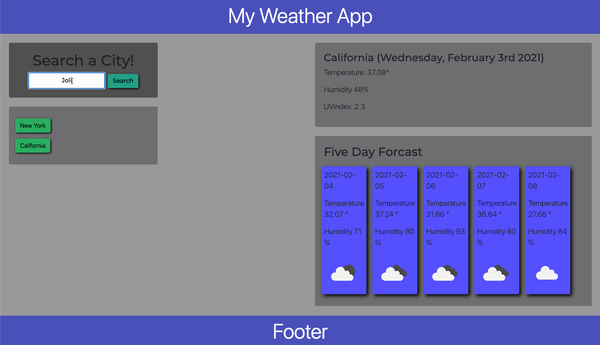

# Weather App Using React Js

## Table of Contents
* [Description](#Description)
* [Links](#Links)
* [Technologies](#Technologies)
* [Gif](#Gif)
* [Author](#Author)
* [Credits](#Credits)
* [License](#License)

## Description 
Welcome to my very own Weather app. Here you will find the ability to search a city, state or country and find the current weather, along with the five day forcast. This project I previously wrote using jQuery, local storage, and Ajax but decided to re-write it using react, sequelize and axios. Have Fun searching your city!


## Technologies
* [JavaScript](https://www.w3schools.com/js/)
* [AOS](https://michalsnik.github.io/aos/)
* [react](https://reactjs.org/)
* [React-Router](https://reactrouter.com/)
* [CSS](https://www.w3schools.com/css/)
* [HTML](https://www.w3schools.com/html/)å
* [JSX](https://reactjs.org/docs/introducing-jsx.html)
* [Axios](https://www.npmjs.com/package/axios)


## Gif


## Code

### Getting the weather
 - Function that once our API file is imported we make the api call to our thrid party weather API. Then take the informaition and set states. 

 ```
 function getCurrentWeather(city) {
    const currentDate = moment().format(" (dddd, MMMM Do YYYY)");
    API.getWeather(city).then((res) => {
      const long = res.data.coord.lon;
      const latt = res.data.coord.lat;
      API.getUV(latt, long).then((response) => {
        const UVindexVal = response.data.value;
        setCurrentWeather({
          ...currentWeather,
          name: res.data.name + currentDate,
          temperature: "Temperature: " + res.data.main.temp + "°",
          humidity: "Humidity " + res.data.main.humidity + "%",
          Windspeed: "Windspeed " + res.data.wind.speed + " MPH",
          UVindex: "UVindex: " + UVindexVal,
        });
      });
    });
  }
 ```

### API client side
 - Here I am exporting an object that contains our API calls from client side to our back end, as well as our third part API.

 ```
const API = {
    // Grab the current weather. 
    getWeather: function(city) {
        return axios.get("https://api.openweathermap.org/data/2.5/weather?q=" + city + "&appid=" + KEY + "&units=imperial")
    },
    getUV: function(latt, long) {
        return axios.get("https://api.openweathermap.org/data/2.5/uvi?lat=" + latt + "&lon=" +long + "&appid=" + KEY)
    },
    get5Day: function(city) {
        return axios.get("https://api.openweathermap.org/data/2.5/forecast?q=" + city + "&appid=" + KEY +  "&units=imperial")
    },
    addCity: function(city) {
        return axios.post("/api/Weather", city);
    },
    getCity: function() {
        return axios.get("/api/Weather");
    }
}
 ```

 ### Using Context

- I decided to provide a context for the components. So here is the code in my context file (creating it) wrapping the components in the provider. 

```
// context file
import React from "react";

const WeatherContext = React.createContext([]);

export default WeatherContext;

// App.js providing context for five day weather.

    <WeatherContext.Provider value={fiveDay}>
              <Cards />
            </WeatherContext.Provider>


```


## Author
Ivan Torres
* [GitHub-Repo](https://github.com/IvanTorresMia)
* [linkedIn](www.linkedin.com/in/ivan-torres-0828931b2)

## Credits
* Credits For this projet goes out to my former instructers and TA's that taught me how to code as well as friends who give me feed back on how to make my projects better.
* [StackOverFlow](https://stackoverflow.com/)


## License]
[](https://www.mit.edu/~amini/LICENSE.md)
# Weather App Using React.js
